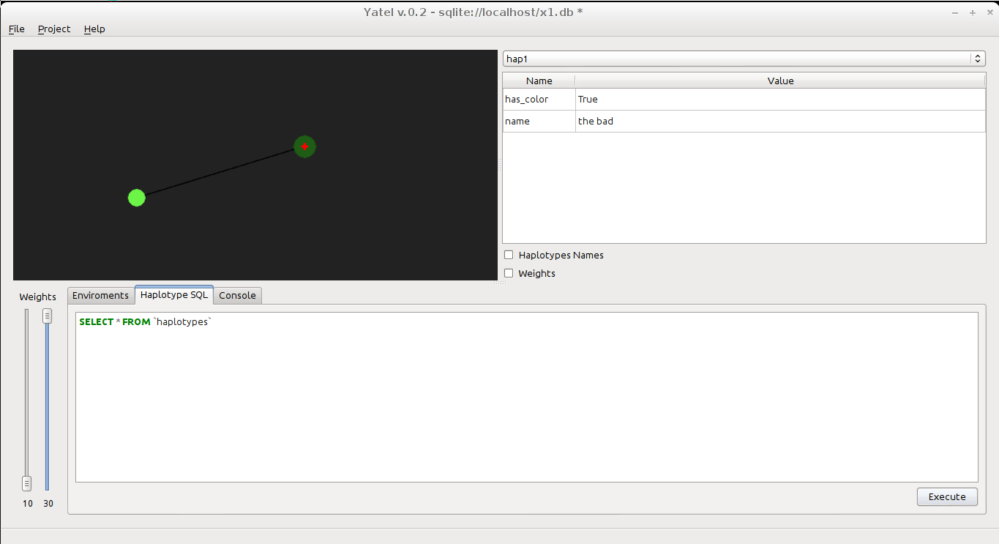

===========================
Yatel YAML/JSON File Format
===========================

Yatel gives to you 2 formats to export/import graphs.

    1. *Yatel Yaml Format* (or yyf) based on YAML_
       (``yatel.conversors.yyf2yatel`` parser)
    2. *Yatel Json Format* (or yjf) based on JSON_
       (``yatel.conversors.yjf2yatel`` parser)

File Extension
--------------

We recommend to use **.yyf** as Yatel Yaml Format file extension and **.yjf**
for Yatel JSON format.

Yatel Gui also support *.json* for yjf and, *.yaml* and *.yml*.
for yyf.

Declaration
-----------

The version `0.1` of the format has four elements on the root of declaration.

- ``version``: A string with the version of the format (actually *0.1*)

  **YYF:**

  .. code-block:: yaml

        version: "0.1"

  **YJF:**

  .. code-block:: javascript

        "version": "0.1",

- ``haplotypes``: A list of objects representing ``yatel.dom.Haplotype``
  instances.

  Every object and has a ``hap_id`` key containing a string with the unique id
  of this haplotype; all the other elements has arbitrary data types and values
  representing all the attributes of the haplotype.

  Also maybe two haplotypes hasn't the same attributes, but if it two or more
  has the same attribute name the value must be of the same type.

  **YYF:**

  .. code-block:: yaml

        haplotypes:
            - hap_id: "hap0"
              name: "the good"
              has_color: false
            - hap_id: "hap1"
              name: "the bad"
              has_color: true

  **YJF:**

  .. code-block:: javascript

        "haplotypes": [
            {
              "has_color": false,
              "hap_id": "hap0",
              "name": "the good"
            },
            {
              "has_color": true,
              "hap_id": "hap1",
              "name": "the bad"
            }
          ],

- ``facts``: A list of objects representing ``yatel.dom.Fact`` instances.

  Every object and has a ``hap_id`` key containing a string with the unique id
  of his haplotype; all the other elements has arbitrary data types and values
  representing all the meta-attributes of the haplotype.

  Also maybe two haplotypes hasn't the same attributes, but if it two or more
  has the same attribute name the value must be of the same type.

  **YYF:**

  .. code-block:: yaml

        facts:
            - hap_id: "hap0"
              place: "Rio IV"
              weather: "Rain"
              year: 2012
            - hap_id: "hap0"
              found_by: "Armando Estaban Quito"
              place: "Rio III"
              weather: "Cold"
              year: 2011
            - hap_id: "hap1"
              found_by: "Nadia Luczywo"
              place: "Cordoba Argentina"
              weather: "Rain"
              year: 1998

  **YJF:**

  .. code-block:: javascript

        "facts": [
            {
              "weather": "Rain",
              "hap_id": "hap0",
              "place": "Rio IV",
              "year": 2012
            },
            {
              "found_by": "Armando Estaban Quito",
              "hap_id": "hap0",
              "place": "Rio III",
              "weather": "Cold",
              "year": 2011
            },
            {
              "found_by": "Nadia Luczywo",
              "hap_id": "hap1",
              "place": "Cordoba Argentina",
              "weather": "Rain",
              "year": 1998
            }
          ],

- ``edge``: A list of objects representing ``yatel.dom.Edge`` instances.

  Every object and has a ``weight`` key containing a float of the value of the
  edge and ``haps_id`` containing a list of string of the haplotypes that this
  edge links.

  example:

  .. code-block:: yaml

        edges:
            - weight: 10
              haps_id:
                  - "hap0"
                  - "hap1"
            - weight: 30
              haps_id:
                  - "hap0"
                  - "hap1"

  **YJF:**

  .. code-block:: javascript

        "edges": [
            {
              "haps_id": [
                "hap0",
                "hap1"
              ],
              "weight": 10.0
            },
            {
              "haps_id": [
                "hap0",
                "hap1"
              ],
              "weight": 30.0
            }
          ]

Full example of YYF
-------------------

.. code-block:: yaml

    # this is an example of Yatel Yaml Format or YYF
    version: "0.1"

    haplotypes:
        - hap_id: "hap0"
          name: "the good"
          has_color: false
        - hap_id: "hap1"
          name: "the bad"
          has_color: true

    facts:
        - hap_id: "hap0"
          place: "Rio IV"
          weather: "Rain"
          year: 2012
        - hap_id: "hap0"
          found_by: "Armando Estaban Quito"
          place: "Rio III"
          weather: "Cold"
          year: 2011
        - hap_id: "hap1"
          found_by: "Nadia Luczywo"
          place: "Cordoba Argentina"
          weather: "Rain"
          year: 1998

    edges:
        - weight: 10
          haps_id:
              - "hap0"
              - "hap1"
        - weight: 30
          haps_id:
              - "hap0"
              - "hap1"

Full example of YJF
-------------------

.. code-block:: javascript

    {
      "version": "0.1",
      "haplotypes": [
        {
          "has_color": false,
          "hap_id": "hap0",
          "name": "the good"
        },
        {
          "has_color": true,
          "hap_id": "hap1",
          "name": "the bad"
        }
      ],
      "facts": [
        {
          "weather": "Rain",
          "hap_id": "hap0",
          "place": "Rio IV",
          "year": 2012
        },
        {
          "found_by": "Armando Estaban Quito",
          "hap_id": "hap0",
          "place": "Rio III",
          "weather": "Cold",
          "year": 2011
        },
        {
          "found_by": "Nadia Luczywo",
          "hap_id": "hap1",
          "place": "Cordoba Argentina",
          "weather": "Rain",
          "year": 1998
        }
      ],
      "edges": [
        {
          "haps_id": [
            "hap0",
            "hap1"
          ],
          "weight": 10.0
        },
        {
          "haps_id": [
            "hap0",
            "hap1"
          ],
          "weight": 30.0
        }
      ]
    }

Screenshot
----------

The 2 examples generates a network like this one

.. _YAML: http://yaml.org/
.. _JSON: http://www.json.org/
